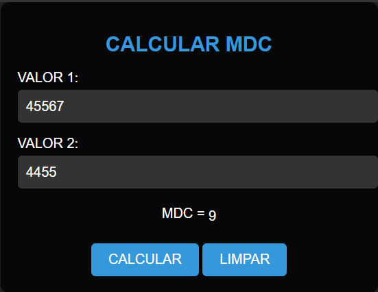

# CALCULAR MDC
🆎CALCULADORA DE MDC EM HTML, CSS E JS.

 <br>

## DESCRIÇÃO:
O "Calculador MDC" é uma aplicação que permite calcular o Máximo Divisor Comum (MDC) de dois números fornecidos pelo usuário. Abaixo estão os principais recursos implementados:

1. Calcular MDC:
   - Ao clicar no botão "CALCULAR", o sistema calcula o MDC dos dois números fornecidos utilizando o algoritmo recursivo.

2. Limpar Campos:
   - Ao clicar no botão "LIMPAR", todos os campos de entrada são resetados, incluindo os valores dos números e o resultado do cálculo do MDC.

## COMO USAR?
### BAIXANDO O PROJETO:
* Clone o repositório para o seu sistema local:

```bash
git clone https://github.com/VILHALVA/CALCULAR-MDC.git
```

* Navegue até o diretório do projeto.

```bash
cd CALCULAR-MDC
```

* Descompacte o arquivo ZIP (se você baixou manualmente):

```bash
unzip CALCULAR-MDC.zip
```

* Abra o arquivo `CODIGO.html` em seu navegador de preferência.

### EXECUTANDO O PROJETO:
1. Informar os Números:
   - Insira o primeiro número no campo "VALOR 1".
   - Insira o segundo número no campo "VALOR 2".

2. Calcular MDC:
   - Após inserir os números, clique no botão "CALCULAR" para calcular o MDC.

3. Visualizar Resultado:
   - O sistema exibirá o resultado do cálculo do MDC na área designada abaixo dos campos de entrada.

4. Limpar Campos:
   - Se desejar limpar os campos e o resultado do cálculo, clique no botão "LIMPAR". Isso restaurará os campos para seus valores padrão e limpará o resultado do cálculo do MDC.

## NÃO SABE?
- Entendemos que para manipular arquivos em `HTML`, `CSS` e outras linguagens relacionadas, é necessário possuir conhecimento nessas áreas. Para auxiliar nesse aprendizado, oferecemos cursos gratuitos disponíveis:
* [Curso de HTML e CSS](https://github.com/VILHALVA/CURSO-DE-HTML-E-CSS)
* [Curso de JavaScript](https://github.com/VILHALVA/CURSO-DE-JAVASCRIPT)
* [Confira mais cursos](https://github.com/VILHALVA?tab=repositories&q=+topic:CURSO)

## CREDITOS:
- [PROJETO CRIADO PELO VILHALVA](https://github.com/VILHALVA)
- [ESTÁ DISPONIVEL NO SITE](https://vilhalva.github.io/STYLER/STYLER.html)

